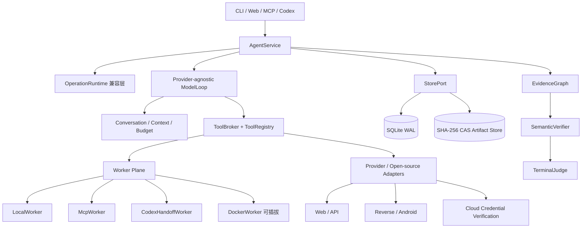

# Trace 项目简介、架构与当前计划

## 1. 项目定位

Trace 是一个证据驱动、可持久恢复、面向强模型战术能力的专业红队 Agent Harness。

Trace 的核心目标不是预先编码一条固定攻击流程，而是让模型能够理解目标、提出假设、选择工具、动态重规划和解释结果，同时由 Runtime 固定执行边界、预算、凭据、证据和终态规则。

### 三个第一性原理

1. **专业红队能力**：覆盖目标理解、攻击面分析、受控验证、影响证明、负向控制、清理和报告。
2. **最大化模型能力**：模型负责战术搜索、工具选择、代码生成、分支和重规划；不把复杂战术压缩成固定动作链。
3. **Runtime 保证证据与不变量**：作用域、预算、凭据、幂等、租约、CAS、Evidence lineage、清理和终态裁决由 Runtime 强制执行。

## 2. 当前能力基线

当前代码已形成以下闭环：

- 版本化 Goal/Core Contracts、Provider/Tool/Worker Ports；
- `AgentService` 统一生命周期，`OperationRuntime` 保留兼容入口；
- Provider-agnostic ModelLoop，支持结构化输出、工具调用、并行、流式和恢复；
- Transcript、Context Compaction、action/token/time 三维预算；
- SQLite WAL、CAS、Lease/Fencing、幂等、取消竞争和进程恢复；
- Local、MCP、Codex、Docker Worker 与隔离 workspace；
- SHA-256 Artifact Store、FTS5、原始输出保存和有界模型投影；
- Phase 6 薄战术循环、ExplorationLedger、分支重开和 ReconDigest；
- ToolRegistry 按能力、风险、目录 revision 和运行级可见性选择工具；
- HTTP、DNS、TCP、Playwright、Capstone、Rizin、Frida、源码搜索、Python AST、APK/DEX 分析；
- EvidenceGraph、SemanticVerifier、TerminalJudge 和五个公开 MCP 工具：
  `redteam_run`、`redteam_status`、`redteam_evidence`、`redteam_cancel`、`redteam_events`。

模型负责假设、战术和局部搜索；Runtime 负责确定性不变量、证据晋升、清理和终态判断。

## 3. 总体架构



### 3.1 模型层

- 只负责理解目标、生成 Intent/Hypothesis、选择工具、处理 Observation 和重新规划；
- 保留原生 system role、structured output、tool calls、parallel calls、streaming 和 usage；
- 每次请求记录 Prompt hash、Provider、Model、Capabilities、Usage 和 Response hash；
- Provider 只做协议转换，不拥有全局状态机。

### 3.2 Runtime 层

- 校验目标、范围、预算和凭据引用；
- 管理 `created/running/waiting_worker/paused_budget/cancelling/cancelled/completed/failed`；
- 处理 CAS、Lease/Fencing、Atomic Commit、幂等和恢复；
- 将工具结果先保存为 Observation，再由 Verifier 决定是否晋升为 Evidence；
- 由 TerminalJudge 根据 GoalContract 判断终态，不相信报告文本或工具成功标志。

### 3.3 SearchGraph、EvidenceGraph、AssetAttackGraph

- **SearchGraph**：模型的 Intent、Hypothesis、分支、优先级和重规划状态；不直接代表事实。
- **EvidenceGraph**：append-only 的 Observation、Artifact、Evidence、Finding 和 lineage；每个节点绑定运行、目标、工具、输入输出 hash 和父证据。
- **AssetAttackGraph**：只接受已验证资产、身份关系、Finding 和攻击路径，用于影响证明和攻击路径分析。

### 3.4 Worker 与 Artifact

- 每次运行使用独立 workspace、环境绑定、超时、取消和 reconcile；
- 大型输出保存到 SHA-256 CAS，SQLite 只保存索引、元数据、引用和 lineage；
- Worker 重启通过幂等键恢复或确认既有结果；
- 外部工具只通过明确的 Adapter 进入 Runtime，不直接改数据库。

## 4. 云环境策略

云环境当前采用“验证优先、工具最少”策略。

### 4.1 对模型只暴露一个云工具

继续扩展现有 `cloud-inventory`，不新增一组独立的云安全工具。

建议操作：

- `credential_check`：验证 AK/SK、临时 Token、OIDC、实例角色和 SSO 身份；
- `permission_check`：可选验证 `Describe/List/Get` 等最小权限；
- `inventory`：凭据确认后进行区域和资产清单读取。

凭据通过 `credential_ref` 从 Runtime 安全通道读取，模型只看到引用，不看到 AK、SK、Token 原文。

### 4.2 验证结果

统一返回：

- `valid`、`missing`、`malformed`、`signature_rejected`、`expired`；
- `permission_denied`、`endpoint_unreachable`、`provider_unavailable`；
- `account_id`、`principal`、`credential_type`、`region`、`expires_at`；
- `request_id`、`latency_ms`、`secret_exposed=false`。

### 4.3 Provider 后端

首批后端：

- 腾讯云：`tccli` / Tencent Cloud SDK；
- 阿里云：`aliyun` / Alibaba Cloud OpenAPI SDK；
- 华为云：`hcloud` 可作为外部后端，Trace 内优先使用官方开源 Python SDK；
- 火山引擎：`ve` / Volcengine SDK；
- 百度智能云：`bce` / BCE SDK；
- 京东云：`jdc` / JDCloud SDK，作为兼容性后端。

这些是 Provider 后端，不新增模型可见工具。已有 AWS、Azure、GCP 后端继续保留。

### 4.4 云权限边界

默认仅使用身份和只读探针：

- 身份、区域、账号、项目、角色；
- `Describe/List/Get` 资产读取；
- 审计和安全结果读取；
- Kubernetes `get/list/watch`。

远程命令、安全组变更、WAF 规则变更、Kubernetes `exec` 等写操作单独申请预算和凭据，并必须生成清理记录。

## 5. 阶段计划与验收标准

### 阶段 0：权威基线

- 固定测试、编译、wheel、隔离安装、self-test、MCP Schema 和 SQLite Schema；
- 保存可恢复的基线提交和确定性快照。

验收：原有测试全通过；快照规范化后连续两次一致；基线可完整恢复。

### 阶段 1：Core Contracts 与 Ports

- 稳定化 Goal、Run、Budget、Intent、Evidence、Finding、Asset、AttackPath、TerminalDecision；
- Core 不依赖 MCP、HTTP、SQLite 或具体 Provider；
- 增加 Schema Version 和向前迁移。

验收：稳定序列化、反序列化、版本升级；旧数据库可重复迁移；依赖边界测试通过。

### 阶段 2：AgentService 与持久生命周期

- 统一 start/run/submit_observation/status/cancel/events；
- 保留 CAS、Lease/Fencing、幂等、恢复和清理语义。

验收：崩溃可恢复；同一幂等键无重复副作用；并发恢复只有一个合法提交者；多目标隔离。

### 阶段 3：Provider-agnostic ModelLoop

- Runtime 驱动模型循环；Provider 仅做协议转换；
- 支持文本、结构化输出、串并行工具调用、流式中断、重试和取消。

验收：Fake Provider 完成可恢复端到端运行；Provider 切换不改变 Goal、Evidence 和 Terminal 语义。

### 阶段 4：Conversation、Context 与 Budget

- 持久化完整 transcript；
- Context Selector 和可追溯 Compactor；
- 原始目标、未满足条款、关键证据和不可逆状态永久保留。

验收：压缩不删除原始消息；预算耗尽进入可恢复暂停；流式半截输出只作为诊断 Artifact。

### 阶段 5：Worker Plane 与 Artifact Store

- Local/MCP/Codex/Docker Worker 统一生命周期；
- 大输出使用 CAS，SQLite 不保存无界 JSON。

验收：篡改、截断、Hash 不匹配可检测；Worker 重启可恢复；workspace、环境变量和凭据隔离。

### 阶段 6：动态 SearchGraph

固定专业质量门：

`Target Intake → Surface Understanding → Hypothesis Search → Controlled Validation → Attack-Path Expansion → Impact Proof → Coverage/Negative Controls → Cleanup → Reporting`

生命周期约束质量，不固定模型动作。模型可以创建、排序、分叉、暂停、否定和重新激活 Intent。

验收：新发现可以动态插入分支；恢复后活动分支和优先队列一致；停滞和重复探索触发重规划。

### 阶段 7：Evidence、Finding 与终态

- EvidenceGraph append-only；
- Finding 必须关联复现证据、影响证明、负向控制和受影响对象；
- TerminalJudge 只接受机器可验证 Evidence。

验收：伪造报告、孤立 Artifact、错误目标证据和缺失父证据均不能完成目标；清理证明缺失时不得成功终结。

### 阶段 8：Web/API Capability

- HTTP、浏览器、API Schema、认证态、会话、入口发现、请求差异和受控验证；
- 建立缺陷与修复后的本地确定性 Web/API fixtures。

验收：从 Intake 到 Reporting 可完成完整流程；报告包含请求/响应差异、影响证据、负向控制、覆盖范围和清理结果。

### 阶段 9：MCP/Codex Adapter 收敛

- MCP、Codex、standalone 全部调用同一个 `AgentService`；
- 保持五个公开 MCP 工具和现有调用兼容；
- Codex handoff 自动回填 Observation。

验收：Schema 兼容；重连、重复提交和中断恢复不重复执行工具；旧 `OperationRuntime` 调用方继续通过测试。

### 阶段 10：CLI、Web Workbench 与事件流

- CLI 提供 start/run/status/resume/cancel/events/evidence；
- Web 只做状态投影，不承载业务规则；
- 支持断线重连和按事件序号继续读取。

验收：UI 重启不影响运行；所有写操作经过 AgentService；CLI 和无 UI 环境保持完整能力。

### 阶段 11：动态多 Agent 与分布式 Worker

- 只在能力缺口、上下文隔离或并行搜索有收益时创建 Specialist；
- Specialist 结果必须经过主 Runtime Verifier 晋升。

验收：Worker 丢失、重复领取、延迟结果和网络分区可恢复；无跨运行上下文或凭据泄漏。

### 当前下一项

当前优先收敛云凭据验证：

1. 将国内云 Provider 加入现有 `cloud-inventory`；
2. 增加 `credential_ref` 安全凭据通道；
3. 增加 `credential_check` 和可选 `permission_check`；
4. 统一错误状态、账号身份、过期时间和 Evidence 记录；
5. 暂不增加独立云审计和云安全工具。

## 6. 运行与部署

```powershell
python -m pip install .
trace self-test
trace setup chromium rizin
trace doctor --json
trace start "审计本地项目" --target .\project --root .\state --max-actions 64
trace run RUN_ID --root .\state
trace status RUN_ID --root .\state
trace events RUN_ID --root .\state --jsonl
trace evidence RUN_ID --root .\state
trace cancel RUN_ID --root .\state --reason operator_stop
```

状态根目录优先级为 `--root`、`TRACE_HOME`、`REDTEAM_AGENT_HOME/operations`，默认目录为 `~/.redteam-agent/operations`。

工具安装通过版本化 manifest、HTTPS、缓存、SHA-256 校验和回滚完成；缺少外部工具时由 Adapter 报告能力状态，不伪造 ready。

## 7. 设计取舍

- 优先复用标准库、现有 Runtime 和官方 OpenAPI/SDK；
- 工具按需安装，不把所有产品客户端打进默认包；
- 一个统一入口优先于大量产品级工具；
- SearchGraph 可动态变化，EvidenceGraph 永远追加；
- JSONL、摘要、报告和文件名都不是事实源；
- 生产代码的正确性由可恢复状态、证据 lineage、幂等和终态裁决保证。
